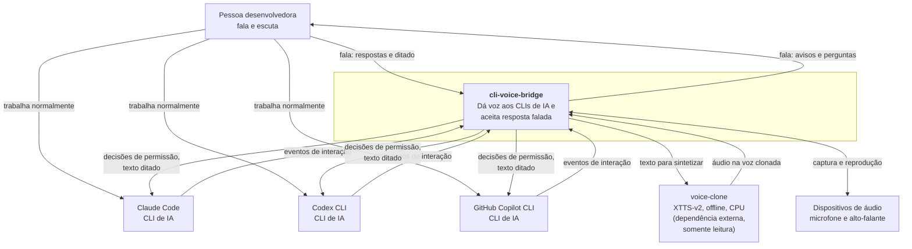

# C4 nível 1 — Contexto

Quem usa o `cli-voice-bridge`, com que sistemas ele conversa e por quê. Detalhe
de contêiner é o [nível 2](02-container.md); não desça para cá.

## O problema que ele resolve

Um agente de IA numa CLI passa boa parte do tempo trabalhando sozinho, e de vez
em quando precisa da pessoa: autorizar um comando, escolher entre alternativas,
avisar que terminou, dizer que abriu um subagente. Quem não está olhando para
aquela janela perde o momento, e o agente fica parado. O `cli-voice-bridge`
avisa por voz e aceita a resposta por voz.

## Fronteiras

**Dentro:** capturar os momentos, decidir o que merece ser dito, falar, escutar e
devolver a resposta ao CLI certo.

**Fora:** clonar a voz (é o `voice-clone`), ser um agente de IA, e substituir as
TUIs — a pessoa continua usando cada CLI como sempre usou.

## Quem interage

| Ator | Papel |
|---|---|
| Pessoa desenvolvedora | Único usuário. Uso pessoal, sem fim comercial |
| Claude Code, Codex CLI, Copilot CLI | Fonte dos eventos e destino das respostas |
| `voice-clone` | Motor de síntese. Dependência externa somente leitura ([ADR-0003](../decisions/0003-tts-delegado-ao-voice-clone.md)) |
| Dispositivos de áudio | Microfone e saída, do sistema |

## Restrições que atravessam tudo

- **Nada sai da máquina.** Sem serviço de nuvem para TTS ou STT
  ([ADR-0003](../decisions/0003-tts-delegado-ao-voice-clone.md),
  [ADR-0006](../decisions/0006-stt-offline-na-maquina.md)).
- **Três sistemas operacionais.** Linux, macOS e Windows são requisito
  ([portability](../specs/portability.md)).
- **Qualquer terminal.** Terminal do sistema, integrado do VS Code, do IntelliJ,
  `tmux`, sessão remota ([ADR-0004](../decisions/0004-hooks-oficiais-como-transporte-primario.md)).
- **Nunca atrapalhar o agente.** Falha deste projeto não pode travar nem atrasar
  o CLI de IA ([ADR-0001](../decisions/0001-nucleo-em-rust-com-cliente-de-hook-separado.md)).
- **Sem uso comercial.** Herdado da licença CPML do XTTS-v2.
