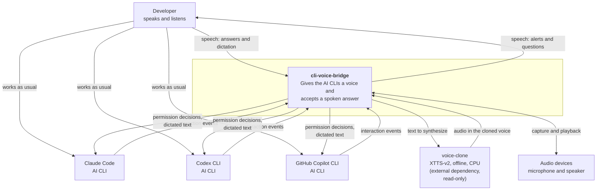

# C4 level 1 — Context

> Translation of [`../../pt-BR/architecture/01-context.md`](../../pt-BR/architecture/01-context.md),
> which is the source of truth.

Who uses `cli-voice-bridge`, what systems it talks to, and why. Container detail
belongs in [level 2](02-container.md); do not bring it down here.

## The problem it solves

An AI agent in a CLI spends most of its time working alone, and every so often
it needs the person: authorize a command, choose between alternatives, report
that it finished, say that it spawned a subagent. Whoever is not watching that
window misses the moment, and the agent sits there waiting. `cli-voice-bridge`
says it out loud and takes the answer by voice.

## Boundaries

**Inside:** capturing the moments, deciding what deserves to be said, speaking,
listening, and delivering the answer back to the right CLI.

**Outside:** cloning the voice (that is `voice-clone`), being an AI agent, and
replacing the TUIs — the person keeps using each CLI exactly as before.

## Who interacts

| Actor | Role |
|---|---|
| Developer | The only user. Personal use, non-commercial |
| Claude Code, Codex CLI, Copilot CLI | Source of the events and destination of the answers |
| `voice-clone` | Synthesis engine. Read-only external dependency ([ADR-0003](../decisions/0003-tts-delegado-ao-voice-clone.md)) |
| Audio devices | Microphone and output, from the operating system |

## Constraints that cut across everything

- **Nothing leaves the machine.** No cloud service for TTS or STT
  ([ADR-0003](../decisions/0003-tts-delegado-ao-voice-clone.md),
  [ADR-0006](../decisions/0006-stt-offline-na-maquina.md)).
- **Three operating systems.** Linux, macOS, and Windows are a requirement
  ([portability](../specs/portability.md)).
- **Any terminal.** System terminal, the integrated terminal in VS Code or
  IntelliJ, `tmux`, remote session
  ([ADR-0004](../decisions/0004-hooks-oficiais-como-transporte-primario.md)).
- **Never get in the agent's way.** A failure in this project must not block or
  slow down the AI CLI
  ([ADR-0001](../decisions/0001-nucleo-em-rust-com-cliente-de-hook-separado.md)).
- **No commercial use.** Inherited from the XTTS-v2 CPML license.
