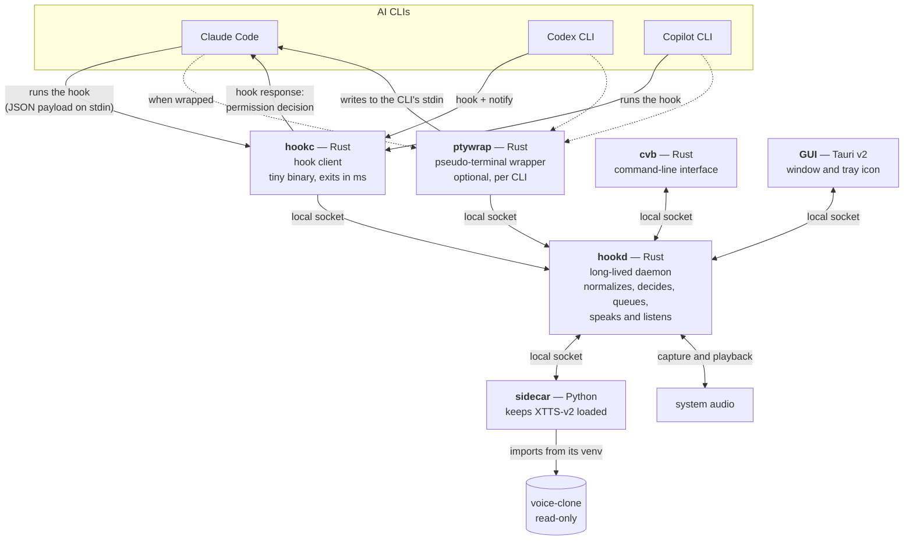

# C4 level 2 — Containers

> Translation of [`../../pt-BR/architecture/02-container.md`](../../pt-BR/architecture/02-container.md),
> which is the source of truth.

The executable pieces of `cli-voice-bridge` and how they talk. What lives inside
`hookd` is [level 3](03-component.md); the surroundings are
[level 1](01-context.md).



## The containers

| Container | Language | Responsibility | Why separate |
|---|---|---|---|
| `hookc` | Rust | Receive the hook payload and pass it to the daemon | Runs in series with the agent, hundreds of times per session — it has to be nearly free ([ADR-0001](../decisions/0001-nucleo-em-rust-com-cliente-de-hook-separado.md)) |
| `hookd` | Rust | All the logic: normalization, policy, queue, STT, IPC | Needs state between events and a loaded model |
| `ptywrap` | Rust | Wrap a CLI in a pseudo-terminal | Fragile by nature; isolated so a defect there does not take the daemon down ([ADR-0005](../decisions/0005-wrapper-pty-como-transporte-complementar.md)) |
| `cvb` | Rust | Command-line interface | A client of the daemon, with no logic of its own |
| GUI | Tauri v2 | Window, tray, configuration, live panel | Same ([ADR-0002](../decisions/0002-gui-em-tauri-v2.md)) |
| `sidecar` | Python | Keep XTTS-v2 loaded and synthesize on demand | The model is Python and takes ~30 s to load ([ADR-0003](../decisions/0003-tts-delegado-ao-voice-clone.md)) |

## How they talk

UNIX socket on Linux and macOS, named pipe on Windows. Never a TCP port
([ADR-0008](../decisions/0008-ipc-por-socket-local.md)). Message-oriented
protocol, versioned in the handshake.

## Layout in the repository

```
crates/core/      moments, protocol, per-platform paths
crates/hookd/     the daemon (adapters and normalization live here)
crates/hookc/     the hook client — the `cvb-hook` binary
crates/cvb/       the CLI
crates/ptywrap/   the pseudo-terminal wrapper
gui/              the Tauri app
sidecar/          the Python bridge to voice-clone
```

Note that the adapters live in `hookd`, not in `core`: the arrow always points
`adapters → core` ([ADR-0007](../decisions/0007-esquema-canonico-de-momentos.md)),
and the core must not know about any CLI.

State per container:

| Container | State |
|---|---|
| `core` | Moments, protocol, IPC (UNIX only), paths, configuration, audio playback, sidecar client |
| `hookc` | Working: reads payload, handshakes, dumps, exits |
| `hookd` | Listens, normalizes, applies the policy, and **speaks**; no priority queue and no listening |
| `cvb` | `doctor`, `daemon status`, `say`, `voices`, `mute`/`unmute` work; the rest exits with an explicit error |
| `ptywrap` | Declared; exits saying it was not implemented |
| GUI | Not created — see `gui/README.md` |
| `sidecar` | Loop and protocol written; synthesis with real XTTS never exercised |

**Why `audio` and `sidecar` live in `core` and not in `hookd`.** `cvb doctor`
has to check the player and the sidecar **without** the daemon running. The
boundary that came out of it is a useful one: `core` holds shared mechanism,
`hookd` holds policy (`redact`, `template`, when to speak).

## Lifecycle

`hookd` comes up on demand (the first `hookc` that does not find the socket asks
for it) or at login, depending on configuration. A `hookc` that finds no daemon
exits with code 0 and in silence — it never blocks the agent.

TODO: decide the autostart mechanism per system: user systemd unit, LaunchAgent,
Scheduled Task.
