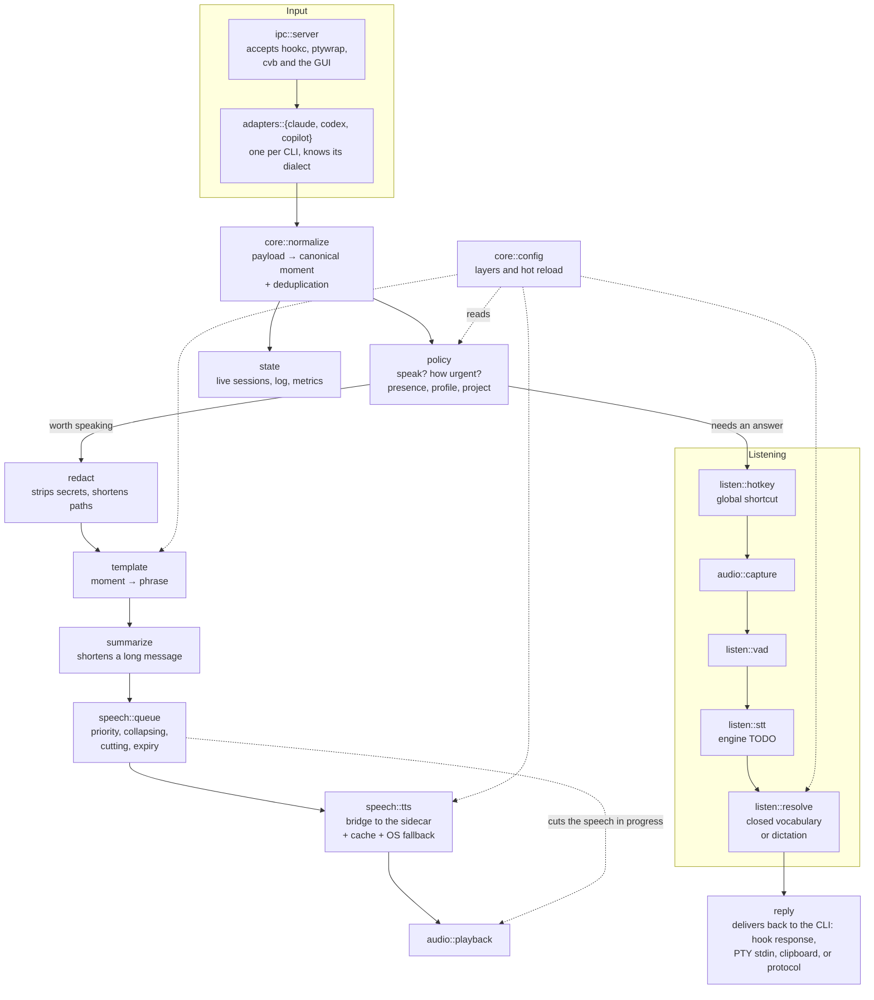

# C4 level 3 — Components of `hookd`

> Translation of [`../../pt-BR/architecture/03-component.md`](../../pt-BR/architecture/03-component.md),
> which is the source of truth.

What lives inside the daemon. The surrounding pieces are in
[level 2](02-container.md).

## Components

| Component | Responsibility | Spec |
|---|---|---|
| `ipc::server` | Accept connections from local clients | [interfaces](../specs/interfaces.md) |
| `adapters::*` | Translate each CLI's dialect. One module per CLI | [event-normalization](../specs/event-normalization.md) |
| `core::normalize` | Canonical moment and deduplication across transports | [event-normalization](../specs/event-normalization.md) |
| `policy` | Decide whether to speak, and how urgently, given presence and profile | [speech-output](../specs/speech-output.md) |
| `redact` | Strip secrets before anything else | [speech-output](../specs/speech-output.md) |
| `template` / `summarize` | Turn a moment into a short phrase | [speech-output](../specs/speech-output.md) |
| `speech::queue` | Priority, collapsing of repeats, cutting, expiry | [speech-output](../specs/speech-output.md) |
| `speech::tts` | Sidecar, cache of fixed phrases, fallback to the OS voice | [speech-output](../specs/speech-output.md) |
| `listen::*` | Shortcut, capture, VAD, transcription, resolution | [speech-input](../specs/speech-input.md) |
| `reply` | Deliver the answer through the right path for each CLI | [speech-input](../specs/speech-input.md) |
| `core::config` | Configuration layers and hot reload | [configuration](../specs/configuration.md) |
| `state` | Live sessions, log with retention, metrics for the GUI | — |

## Dependencies between components

`adapters` depends on `core`; `core` does not depend on `adapters`. That is what
lets a fourth CLI be added without touching the core
([ADR-0007](../decisions/0007-esquema-canonico-de-momentos.md)).

`redact` runs **before** `template` and before any logging. A secret must not
reach the template or the disk.

## Level 4 (code)

Deliberately absent. There is little code yet, and even later a class diagram
would not pay for its maintenance in a project this size. If some module gets
intricate enough to justify one, create `04-code.md` for that module alone — not
for the whole system.
