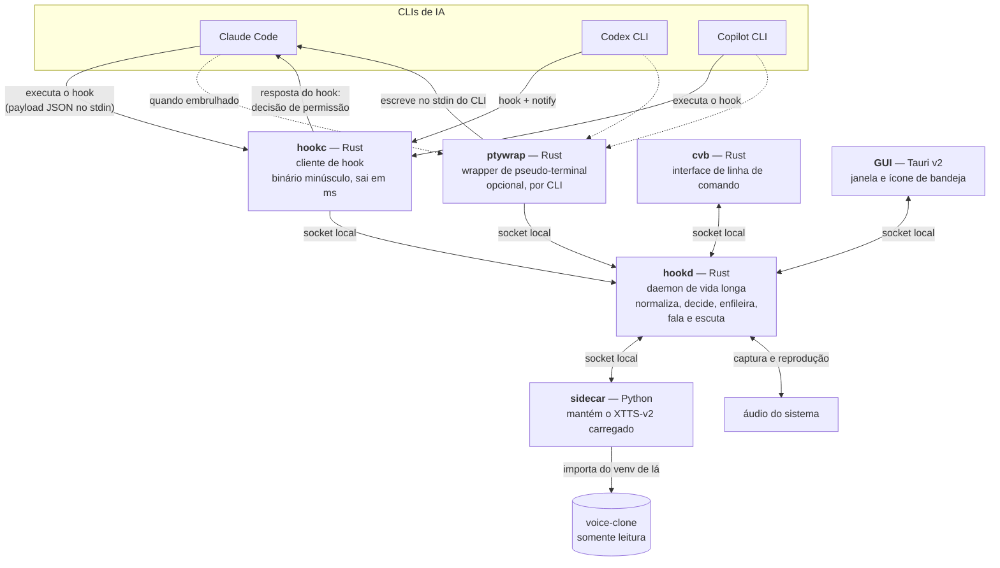

# C4 nível 2 — Contêineres

As peças executáveis do `cli-voice-bridge` e como elas conversam. O que está
dentro do `hookd` é o [nível 3](03-component.md); o entorno é o
[nível 1](01-context.md).



## Os contêineres

| Contêiner | Linguagem | Responsabilidade | Por que separado |
|---|---|---|---|
| `hookc` | Rust | Receber o payload do hook e repassar ao daemon | Roda em série com o agente, centenas de vezes por sessão — precisa ser quase gratuito ([ADR-0001](../decisions/0001-nucleo-em-rust-com-cliente-de-hook-separado.md)) |
| `hookd` | Rust | Toda a lógica: normalização, política, fila, STT, IPC | Precisa de estado entre eventos e de modelo carregado |
| `ptywrap` | Rust | Embrulhar um CLI num pseudo-terminal | Frágil por natureza; isolado para que um defeito nele não derrube o daemon ([ADR-0005](../decisions/0005-wrapper-pty-como-transporte-complementar.md)) |
| `cvb` | Rust | Interface de linha de comando | Cliente do daemon, sem lógica própria |
| GUI | Tauri v2 | Janela, bandeja, configuração, painel ao vivo | Idem ([ADR-0002](../decisions/0002-gui-em-tauri-v2.md)) |
| `sidecar` | Python | Manter o XTTS-v2 carregado e sintetizar sob demanda | O modelo é Python e leva ~30 s para carregar ([ADR-0003](../decisions/0003-tts-delegado-ao-voice-clone.md)) |

## Como conversam

Socket UNIX no Linux e no macOS, named pipe no Windows. Nunca porta TCP
([ADR-0008](../decisions/0008-ipc-por-socket-local.md)). Protocolo orientado a
mensagem, com versão no handshake.

## Layout pretendido no repositório

```
crates/core/      esquema de momentos, protocolo, caminhos por plataforma
crates/hookd/     o daemon (adaptadores e normalização moram aqui)
crates/hookc/     o cliente de hook — binário `cvb-hook`
crates/cvb/       a CLI
crates/ptywrap/   o wrapper de pseudo-terminal
gui/              a aplicação Tauri
sidecar/          a ponte Python para o voice-clone
```

Repare que os adaptadores ficam no `hookd`, não no `core`: a seta é sempre
`adapters → core` (ADR-0007), e o núcleo não pode conhecer nenhum CLI.

Estado por contêiner:

| Contêiner | Estado |
|---|---|
| `core` | momentos, protocolo, IPC (só UNIX), caminhos, configuração, reprodução de áudio, cliente do sidecar |
| `hookc` | funcional: lê payload, faz handshake, despeja e sai |
| `hookd` | escuta, normaliza, aplica a política, enfileira e **fala**; falta a entrada por voz |
| `cvb` | `doctor`, `daemon status`, `say`, `voices`, `mute`/`unmute` de pé; o resto sai com erro explícito |
| `ptywrap` | declarado, sai com erro dizendo que não foi implementado |
| GUI | não criada — ver `gui/README.md` |
| `sidecar` | laço e protocolo escritos; a síntese com XTTS de verdade ainda não foi exercitada |

**Por que `audio` e `sidecar` moram no `core` e não no `hookd`.** O `cvb doctor`
precisa checar reprodutor e sidecar **sem** o daemon de pé. A fronteira que
resultou é útil: `core` guarda mecanismo compartilhado, `hookd` guarda política
(`redact`, `template`, quando falar).

## Ciclo de vida

O `hookd` sobe sob demanda (o primeiro `hookc` que não achar o socket pede para
subir) ou no login, conforme configuração. `hookc` que não encontra daemon sai
com código 0 e em silêncio — nunca trava o agente.

Arranque, encerramento ordenado, instância única e supervisão do sidecar estão
em [daemon-lifecycle](../specs/daemon-lifecycle.md), com o que já funciona e o
que ainda não.
