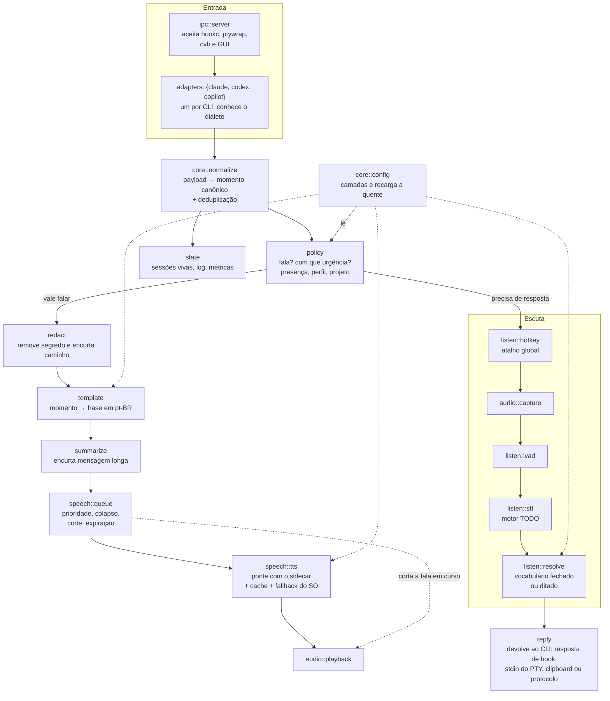

# C4 nível 3 — Componentes do `hookd`

O que existe dentro do daemon. As peças ao redor estão no
[nível 2](02-container.md).

## Componentes

| Componente | Responsabilidade | Spec |
|---|---|---|
| `ipc::server` | Aceitar conexões dos clientes locais | [interfaces](../specs/interfaces.md) |
| `adapters::*` | Traduzir o dialeto de cada CLI. Um módulo por CLI | [event-normalization](../specs/event-normalization.md) |
| `core::normalize` | Momento canônico e deduplicação entre transportes | [event-normalization](../specs/event-normalization.md) |
| `policy` | Decidir se fala, com que urgência, considerando presença e perfil | [speech-output](../specs/speech-output.md) |
| `policy::presenca` | Presente ou ausente — **não existe ainda** | [presence-detection](../specs/presence-detection.md) |
| `speech::redact` | Tirar segredo antes de qualquer outra coisa | [speech-output](../specs/speech-output.md) |
| `speech::template` | Momento vira frase curta em pt-BR | [speech-output](../specs/speech-output.md) |
| `speech::Voz` | Orquestra redigir → sintetizar → tocar, com cache e degradação | [speech-output](../specs/speech-output.md) |
| `core::sidecar` | Cliente do sidecar de síntese | [speech-output](../specs/speech-output.md) |
| `core::audio` | Reprodução por programa do sistema e voz de emergência | [ADR-0009](../decisions/0009-reproducao-por-reprodutor-do-sistema.md) |
| `speech::queue` | Prioridade, colapso de repetidos, expiração e corte | [speech-output](../specs/speech-output.md) |
| `listen::*` | Atalho, captura, VAD, transcrição, resolução | [speech-input](../specs/speech-input.md) |
| `reply` | Entregar a resposta pelo caminho certo de cada CLI | [speech-input](../specs/speech-input.md) |
| `core::config` | Camadas de configuração e recarga a quente | [configuration](../specs/configuration.md) |
| `state` | Sessões vivas, log com retenção, métricas para a GUI | — |

## Dependências entre componentes

`adapters` depende de `core`; `core` não depende de `adapters`. É o que permite
acrescentar um quarto CLI sem tocar no núcleo
([ADR-0007](../decisions/0007-esquema-canonico-de-momentos.md)).

`redact` roda **antes** de `template` e de qualquer log. Segredo não pode chegar
ao molde nem ao disco.

`core::audio` e `core::sidecar` ficam no núcleo, não no `hookd`, porque o
`cvb doctor` precisa checá-los sem o daemon de pé. A regra que sobrou: **`core` é
mecanismo, `hookd` é política.**

`speech::queue` tem uma trabalhadora própria: o `hookc` do outro lado roda em
série com o agente de IA e não pode esperar pelo áudio (ADR-0001). Enfileirar é
imediato; falar acontece depois, noutra thread.

`Voz::falar` continua serializado por mutex — a fila garante que só há uma
chamada por vez, e o mutex é a rede de segurança para quem chamar de outro lugar
(o `cvb say`, por exemplo).

## Nível 4 (código)

Deliberadamente ausente. Não há código ainda, e mesmo depois um diagrama de
classes não paga o custo de manutenção num projeto deste tamanho. Se algum
módulo ficar intrincado o bastante para justificar, cria-se `04-code.md` só para
ele — não para o sistema todo.
